# Progetto Spring Boot: Triple_Helix_Project

## 1. Installazione di un IDE

Installa un IDE che supporta Java come **Eclipse**. Puoi scaricare l'installer da [qui](https://www.eclipse.org/downloads/download.php?file=/oomph/epp/2024-09/R/eclipse-inst-jre-win64.exe), e durante l'installazione scegli l'opzione come **Java Developer**.

## 2. Guida per la Configurazione di Spring Boot su Eclipse

Dopo l'installazione di Eclipse, dovrai installare il framework Spring Boot dal Marketplace di Eclipse.

### Passaggi:

1. Vai su **Help** e poi su **Eclipse Marketplace**.

   <p align="center">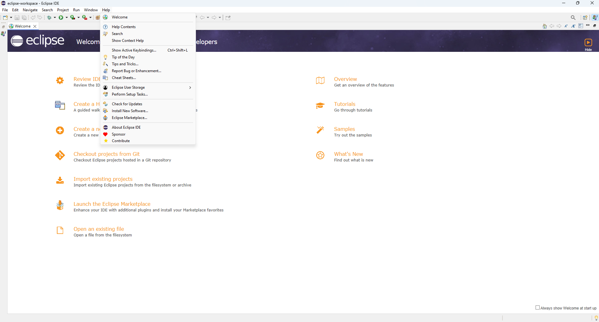</p>

2. Nella search bar, cerca **spring boot**.

   <p align="center">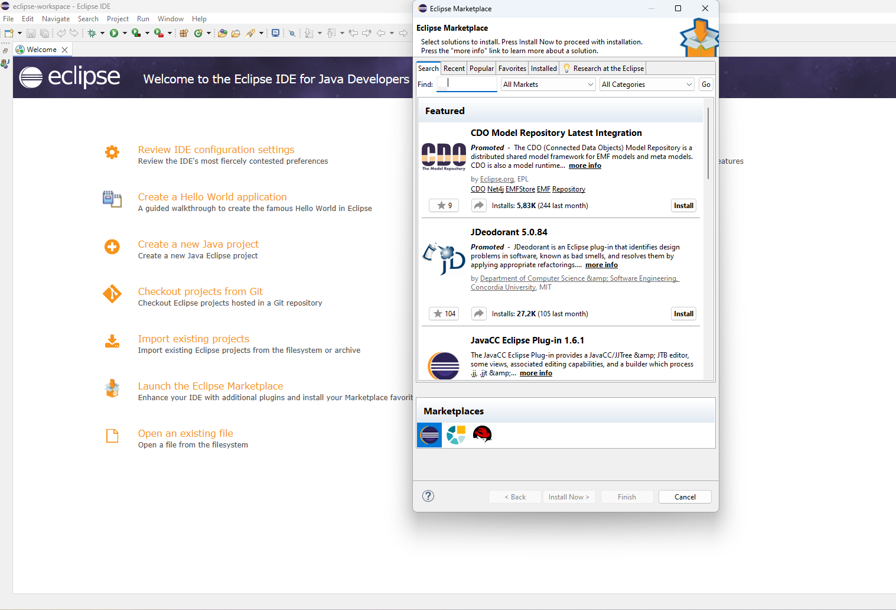</p>

3. Seleziona la **versione 4 di Spring Boot**.

   <p align="center">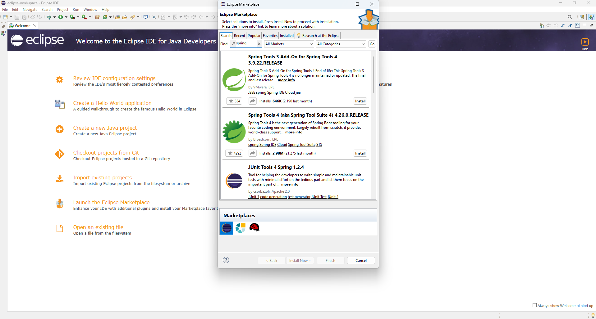</p>

4. Installa Spring Boot e clicca su **Trust Selected**.

   <p align="center">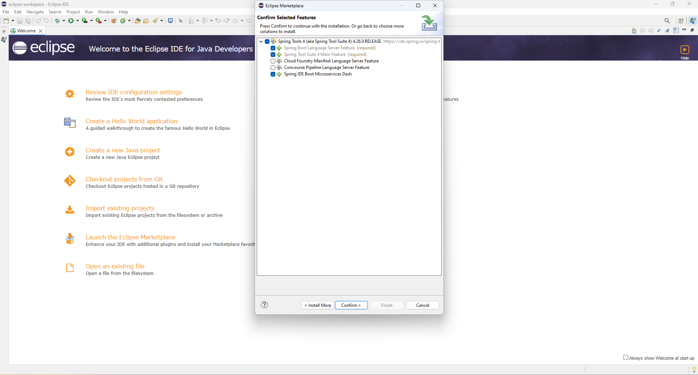</p>

   <p align="center">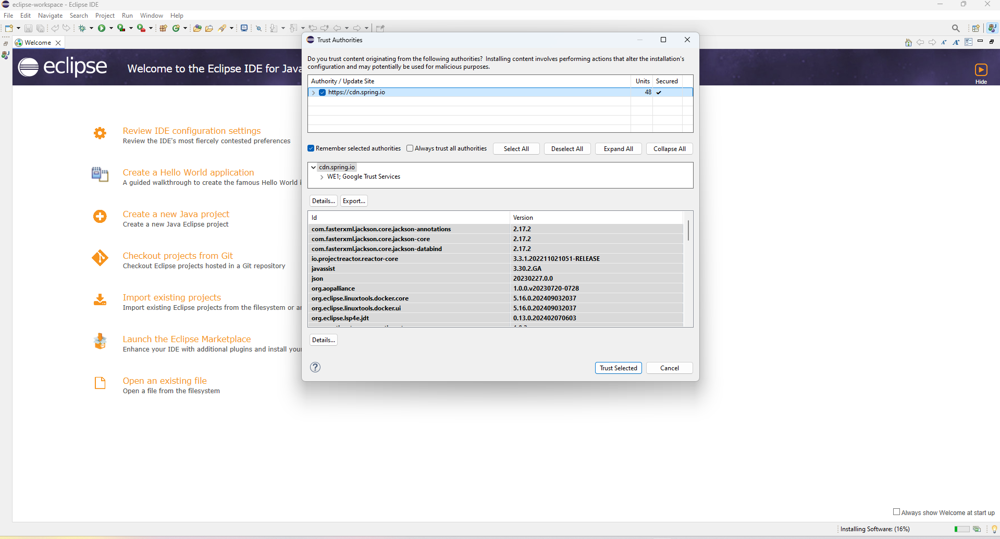</p>
   
   <p align="center">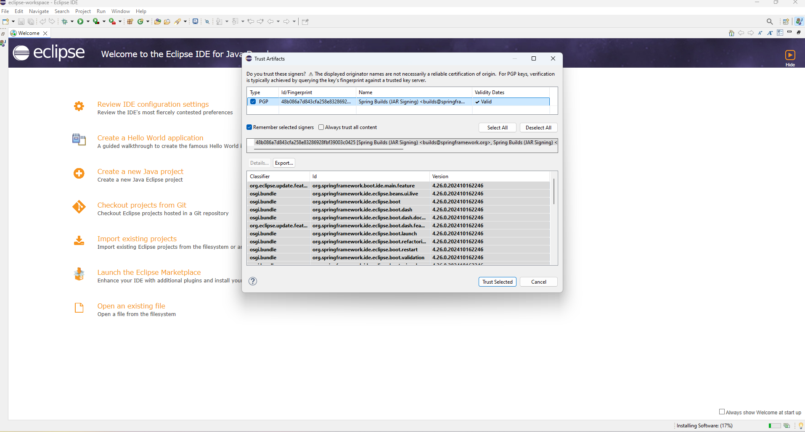</p>

## 3. Installazione di un Server Manager

Utilizza un server manager come **XAMPP**, scaricabile da [qui](https://www.apachefriends.org/it/index.html).

## 4. Guida all'Importazione del Database su XAMPP

### Passaggi:

1. Installa XAMPP e avvia il servizio **MySQL** cliccando su **Start**.

   <p align="center">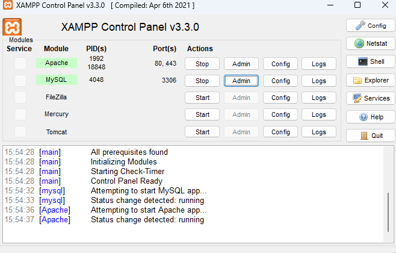</p>

2. Clicca su **Admin**, che ti porterà alla pagina: [http://localhost/phpmyadmin/index.php](http://localhost/phpmyadmin/index.php). Qui, crea un nuovo database chiamato **triple_helix_cascina_caccia**, premi su di esso e poi clicca su **Importa** per caricare il file `triple_helix_cascina_caccia.sql` dalla cartella del progetto, mantenendo le impostazioni di default.

   <p align="center">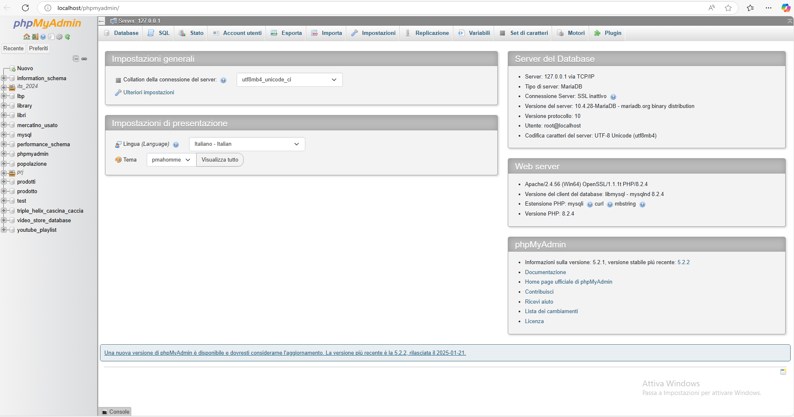</p>

## 5. Importare il Progetto sull'IDE

### Passaggi:

1. Vai su **File** in alto a sinistra e seleziona **Importa** dal menu a tendina.

   <p align="center">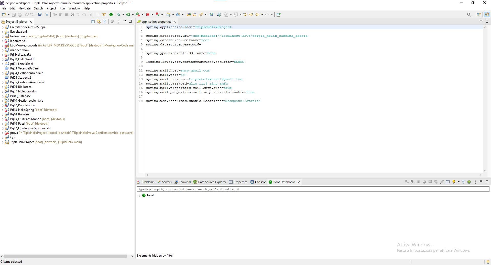</p>

2. Scegli l'opzione **Maven esistente**.

   <p align="center">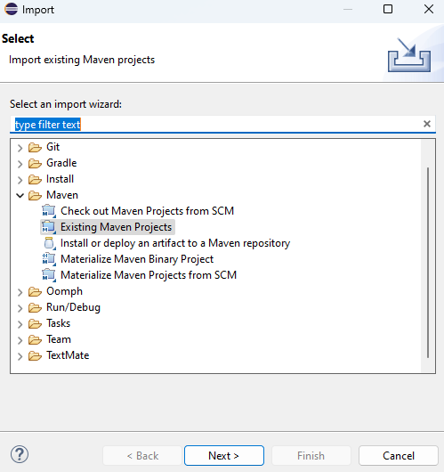</p>

3. Seleziona la **cartella** dove si trova il progetto e clicca su **Finish**.

   <p align="center">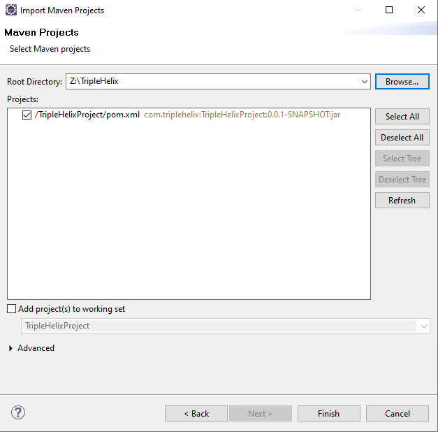</p>

---


## 6. Configurazione delle Application Properties

Puoi modificare le impostazioni di connessione al database nel file `application.properties`.

### Esempio di configurazione:

```properties
# Nome dell'applicazione
spring.application.name=TripleHelixProject

# Configurazione del database MariaDB
spring.datasource.url=jdbc:mariadb://localhost:3306/triple_helix_cascina_caccia
spring.datasource.username=root
spring.datasource.password=


# Configurazione di Thymeleaf
spring.thymeleaf.prefix=classpath:/templates/
spring.thymeleaf.suffix=.html

#Configurazione Email Sender
spring.mail.host=smtp.gmail.com
spring.mail.port=587
spring.mail.username=triplehelixtest1@gmail.com
spring.mail.password=gliu rrrj zinq amfu
spring.mail.properties.mail.smtp.auth=true
spring.mail.properties.mail.smtp.starttls.enable=true

# Livello di logging
logging.level.org.springframework.security=DEBUG
```


## 7. Dipendenze del Progetto

Ecco un elenco delle principali dipendenze utilizzate nel progetto:

### 1. Spring Boot Starter Parent  
Il progetto eredita dal parent `spring-boot-starter-parent`, che fornisce configurazioni predefinite per le dipendenze, la gestione delle versioni e le impostazioni del build di Spring Boot.  

```xml
<parent>
    <groupId>org.springframework.boot</groupId>
    <artifactId>spring-boot-starter-parent</artifactId>
    <version>3.4.0</version>
    <relativePath/>
</parent>
```

---

### 2. Spring Boot Starter Data JPA  

```xml
<dependency>
    <groupId>org.springframework.boot</groupId>
    <artifactId>spring-boot-starter-data-jpa</artifactId>
</dependency>
```

**Uso:** Fornisce supporto per l'accesso ai database relazionali utilizzando l'API JPA.

---

### 3. Spring Boot Starter Thymeleaf  

```xml
<dependency>
    <groupId>org.springframework.boot</groupId>
    <artifactId>spring-boot-starter-thymeleaf</artifactId>
</dependency>
```

**Uso:** Integrazione con il motore di template Thymeleaf per la creazione di pagine web dinamiche.

---

### 4. Spring Boot Starter Web  

```xml
<dependency>
    <groupId>org.springframework.boot</groupId>
    <artifactId>spring-boot-starter-web</artifactId>
</dependency>
```

**Uso:** Fornisce le funzionalità per sviluppare applicazioni web con Spring MVC.

---

### 5. Thymeleaf Extras Spring Security  

```xml
<dependency>
    <groupId>org.thymeleaf.extras</groupId>
    <artifactId>thymeleaf-extras-springsecurity6</artifactId>
</dependency>
```

**Uso:** Estensioni per Thymeleaf che consentono di integrare Spring Security all'interno delle viste.

---

### 6. Spring Boot DevTools  

```xml
<dependency>
    <groupId>org.springframework.boot</groupId>
    <artifactId>spring-boot-devtools</artifactId>
    <scope>runtime</scope>
    <optional>true</optional>
</dependency>
```

**Uso:** Migliora l'esperienza di sviluppo con funzionalità di ricaricamento automatico.

---

### 7. MariaDB JDBC Driver  

```xml
<dependency>
    <groupId>org.mariadb.jdbc</groupId>
    <artifactId>mariadb-java-client</artifactId>
    <scope>runtime</scope>
</dependency>
```

**Uso:** Fornisce il driver JDBC per connettersi a database MariaDB.

---

### 8. Spring Boot Starter Test  

```xml
<dependency>
    <groupId>org.springframework.boot</groupId>
    <artifactId>spring-boot-starter-test</artifactId>
    <scope>test</scope>
</dependency>
```

**Uso:** Contiene strumenti per effettuare test delle applicazioni Spring Boot.

---

### 9. Spring Security Test  

```xml
<dependency>
    <groupId>org.springframework.security</groupId>
    <artifactId>spring-security-test</artifactId>
    <scope>test</scope>
</dependency>
```

**Uso:** Fornisce strumenti di testing specifici per applicazioni protette con Spring Security.

---

### 10. JWT (JSON Web Token) API  

```xml
<dependency>
    <groupId>io.jsonwebtoken</groupId>
    <artifactId>jjwt-api</artifactId>
    <version>0.11.5</version>
</dependency>
<dependency>
    <groupId>io.jsonwebtoken</groupId>
    <artifactId>jjwt-impl</artifactId>
    <version>0.11.5</version>
</dependency>
<dependency>
    <groupId>io.jsonwebtoken</groupId>
    <artifactId>jjwt-jackson</artifactId>
    <version>0.11.5</version>
</dependency>
```

**Uso:** Libreria per la creazione, verifica e gestione di JSON Web Token (JWT).

---

### 11. Spring Boot Starter Mail  

```xml
<dependency>
    <groupId>org.springframework.boot</groupId>
    <artifactId>spring-boot-starter-mail</artifactId>
</dependency>
```

**Uso:** Supporta l'invio di email tramite protocolli come SMTP.

---

## 8. Configurazione di Build

Il progetto utilizza il **Spring Boot Maven Plugin**, che semplifica il processo di build e packaging dell'applicazione:

```xml
<build>
    <plugins>
        <plugin>
            <groupId>org.springframework.boot</groupId>
            <artifactId>spring-boot-maven-plugin</artifactId>
        </plugin>
    </plugins>
</build>
```

**Uso:** Questo plugin fornisce strumenti per l'esecuzione, il packaging e la distribuzione dell'applicazione Spring Boot come file JAR eseguibile.

## 8. File `pom.xml`

Il file `pom.xml` gestisce le dipendenze di Maven per l'applicazione Spring Boot e include tutte le librerie necessarie per il corretto funzionamento.

### Esempio di configurazione `pom.xml`:

```xml
<project>
    <modelVersion>4.0.0</modelVersion>
    <groupId>com.example</groupId>
    <artifactId>TripleHelixProject</artifactId>
    <version>0.0.1-SNAPSHOT</version>

    <properties>
        <java.version>17</java.version>
    </properties>

    <dependencies>
        <!--Dipendenze -->
    </dependencies>
</project>
```

## 9. Esecuzione dell'Applicazione

### Passaggi per l'esecuzione:

1. **Avvio dell'applicazione**: Una volta completata la compilazione, avvia l'applicazione usando **"Run As" > Spring Boot App**. Questo avvierà l'applicazione sul server locale (porta predefinita: 8080).

2. **Verifica dell'esecuzione**: Apri il browser e naviga verso [http://localhost:8080](http://localhost:8080) per vedere l'applicazione in esecuzione.

---